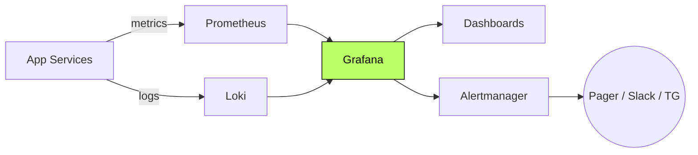

<div align="center">

```
    ██████╗ ██████╗ ███████╗
   ██╔═══██╗██╔══██╗██╔════╝
   ██║   ██║██████╔╝███████╗
   ██║   ██║██╔══██╗╚════██║
   ╚██████╔╝██████╔╝███████║
    ╚═════╝ ╚═════╝ ╚══════╝
```

# Self-Hosted Observability Stack

#### Metrics · logs · dashboards · alerts.
#### The system that tells you what's actually happening in production.

[](#)
[](#)
[](#)
[](#)

</div>

---

> **TL;DR** — A self-hosted observability stack — Grafana, Prometheus, Loki —
> that powers the systems I run. No third-party vendor lock-in, no
> per-event billing surprises.

---

## Overview

The observability layer for the trading and launchpad systems I operate.
Metrics from Prometheus, logs from Loki, dashboards and alerting in
Grafana. Self-hosted, versioned, and reproducible.

> This repository documents the system at the **architectural level**.
> Implementation code is private.

---

## My Role

> **DevOps / SRE.** Stack design, dashboard authoring, alert tuning.

- Stack composition and deployment
- Metric and log schema design
- Dashboard authoring
- Alert tuning (signal-to-noise)

---

## Architecture



---

## Capabilities

- **Metrics** — RED + business metrics
- **Logs** — structured, searchable, retained
- **Dashboards** — per-service + per-incident
- **Alerts** — page only on actual divergence

---

## Architectural Decisions & Tradeoffs

### 1. Self-hosted by default

Vendor SaaS has per-event billing that scales badly with high-throughput
systems. Self-hosting is more setup but a known cost.

### 2. Alerts on divergence, not on absence

Pages fire when something **diverges** from policy. Quiet metrics don't
page. Result: nobody learns to ignore the pager.

### 3. Dashboards mirror system state

Each service has a dashboard that mirrors its own internal state. If you
can't see it on a board, the service can't see it about itself.

---

## Engineering Invariants

- **Never** ship a service without metrics
- **Never** ship an alert without a runbook
- **Never** alert on a symptom of a symptom

---

## Related Public Documents

- [`market-making-infra`](https://github.com/eldardzh/market-making-infra) — primary consumer of this stack
- [`hetzner-terraform-modules`](https://github.com/eldardzh/hetzner-terraform-modules) — IaC layer

---

<div align="center">

#### **Contact**
[**eldardzh.com**](https://eldardzh.com) · [**@EldarDissmay**](https://x.com/EldarDissmay) · **dissmay21@gmail.com**

<sub>© 2026 · Eldar D.</sub>

</div>
